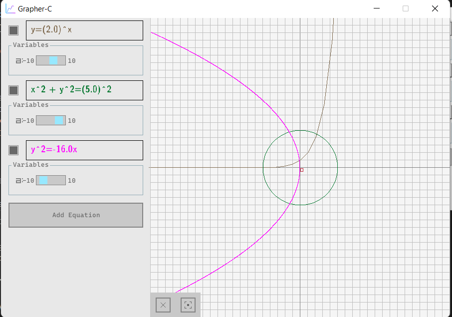

# Grapher-C

A 2d graph plotter in c made by the students of IOE Pulchowk Campus Computer Enginnering Students as a project for first semester.

## Contributors
```
Krishant Timilsina   (078BCT045)
Bishal Panta         (078BCT036)
Prabin Adhikari      (078BCT058)
Apil Chaudary        (078BCT017)
```

## Screenshot


## 🔨 Build

###  📋 Requirements

To setup and use the project you will need to have the following tools installed:
 - [Xmake](https://xmake.io/)
 - [Cmake](https://cmake.org/)

###  ⬇️ Installation

Clone the repository

```bash
$ git clone https://github.com/krishtimil/grapher-c.git
```


Change the working directory to the newly cloned repository:

```bash
$ cd grapher-c
```
### For Windows
Run the powershell script
```
./run.ps1
```

### For Linux/macOS
Run xmake to install the dependencies & build the project:

```bash
$ xmake
note: install or modify (m) these packages (pass -y to skip confirm)?
in xmake-repo:
  -> raylib 4.0.0
please input: y (y/n/m)

  => download https://github.com/raysan5/raylib/releases/download/4.0.0/raylib-4.0.0_macos.tar.gz .. ok
  => install raylib 4.0.0 .. ok
[ 16%]: ccache compiling.release src/ui.c
[ 16%]: ccache compiling.release src/main.c
[ 16%]: ccache compiling.release src/graph.c
[ 66%]: linking.release grapher-c
[100%]: build ok!
```

Run the project after it has been built:

```bash
$ xmake run
```

You need to move the `res` folder to directory with the executable for proper functionality.
